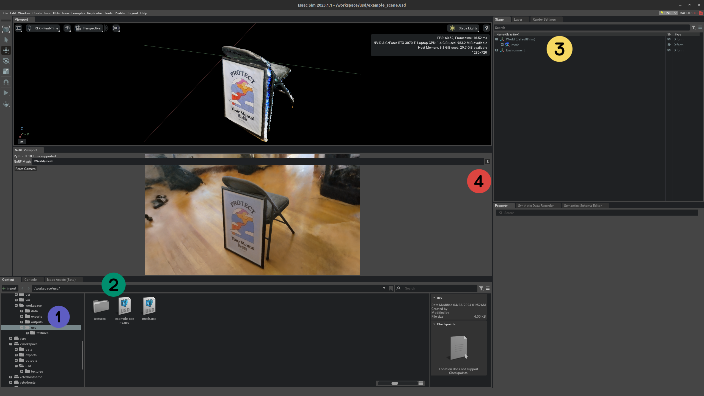

# Omniverse NeRF Extension

Neural Radiance Field (NeRF) extension for Omniverse.

> For 3D Gaussian Splatting (3DGS) support, please refer to the [Omniverse 3DGS Extension](https://github.com/j3soon/omni-3dgs-extension).

## Prerequisites

- **Hardware**:
  - CPU: x86
  - GPU: NVIDIA RTX GPU
  - See [this page](https://docs.omniverse.nvidia.com/isaacsim/latest/installation/requirements.html#system-requirements) for more details.
- **Operating System**: Ubuntu 20.04/22.04.
- **Software**:
  - [NVIDIA Driver](https://ubuntu.com/server/docs/nvidia-drivers-installation)
  - [Docker](https://docs.docker.com/engine/install/ubuntu/)
  - [NVIDIA Container Toolkit](https://docs.nvidia.com/datacenter/cloud-native/container-toolkit/latest/install-guide.html)
  - Omniverse Isaac Sim (through NGC Container)

## Demo

https://github.com/j3soon/omni-nerf-extension/assets/20457146/4b022624-a172-40b5-a5ad-c0ae678412f8

> At the exterior of the National Tsing Hua University (NTHU) swimming pool. Collected by [@muyishen2040](https://github.com/muyishen2040), which is also used in the [DriveEnv-NeRF project](https://github.com/muyishen2040/DriveEnvNeRF).

https://github.com/j3soon/omni-nerf-extension/assets/20457146/40835ce5-5834-4631-aa17-1b591e402f27

> Exterior of the Delta Building in National Tsing Hua University (NTHU). Collected by [@Howardkhh](https://github.com/Howardkhh).

https://github.com/j3soon/omni-nerf-extension/assets/20457146/049ff215-7a68-477b-9bc3-57b4cb3a889e

> The UR5 Robotic Arm in [ElsaLab](https://github.com/elsa-lab).

https://github.com/j3soon/omni-nerf-extension/assets/20457146/3c9d657c-772d-4a83-9ac0-7af8c301d24f

> The Husky UGV in [ElsaLab](https://github.com/elsa-lab).

**Note**: The datasets for these demos are not provided in this repository as they are casually collected. The purpose of these demos is to illustrate that this repository can be readily applied to a variety of custom datasets with extremely low effort. The following guide will use the `Poster` dataset for simplicity.

## Setup

```sh
git clone https://github.com/j3soon/omni-nerf-extension
cd omni-nerf-extension
```

Download assets:

```sh
wget https://github.com/j3soon/omni-nerf-extension/releases/download/v0.0.2/assets.zip
unzip assets.zip
```

Prepare assets for `nerfstudio_renderer`:

```sh
# change the DATE_TIME to the name of the placeholder
DATE_TIME=2023-12-30_111633
CHECKPOINT_NAME=step-000029999
cp -r ./assets/outputs/poster/nerfacto/$DATE_TIME ./assets/outputs/poster/nerfacto/DATE_TIME
mv ./assets/outputs/poster/nerfacto/DATE_TIME/nerfstudio_models/$CHECKPOINT_NAME.ckpt ./assets/outputs/poster/nerfacto/DATE_TIME/nerfstudio_models/CHECKPOINT_NAME.ckpt
```

The following assumes that you are running the commands from the root of the repository.

## Managing Containers

Build the docker images for the extension:

```sh
docker compose build
```

Launch the containers:

```sh
# You might want to use `tmux` for exec-ing into the containers later
xhost +local:docker
docker compose up
```

Then follow the remaining sections.

To remove and stop the containers, run:

```sh
docker compose down
```

### Nerfstudio Renderer

Code: [`nerfstudio_renderer`](./nerfstudio_renderer)

The renderer server would be listening on port `10001` upon successful startup:

```
INFO SLAVE/10001[MainThread]: server started on [0.0.0.0]:10001
```

After seeing the above logs, no additional steps are required for the renderer server.

### PyGame Viewer

Code: [`pygame_viewer`](./pygame_viewer)

Attach to the container and run the testing script:

```sh
docker exec -it pygame-viewer /src/run.sh
```

The script may fail at the first run due to the cold start of the renderer server. If it fails, try run the script again.

https://github.com/j3soon/omni-nerf-extension/assets/20457146/c971d623-30d1-4cfc-ba47-666dd99e021d

### Isaac Sim Viewer

Code: [`extension`](./extension)

```sh
docker exec -it isaac-sim-viewer bash
# in container
/isaac-sim/runapp.sh --ext-folder /src/exts --enable omni.nerf.viewport
```

> Alternatively, you can use WebRTC by running:
> 
> ```sh
> # in container
> /isaac-sim/runheadless.webrtc.sh --ext-folder /src/exts --enable omni.nerf.viewport
> ```
> 
> Wait for the `Isaac Sim Headless WebRTC App is loaded.` message,
> and then visit <http://127.0.0.1:8211/streaming/webrtc-demo/?server=127.0.0.1> in Google Chrome.



1. Select the folder `/workspace/usd`
2. Open the file `example_scene.usd`
3. Click the mesh that you added in Step 2.
4. Press the button in NeRF Viewport to update the input mesh of NeRF.

https://github.com/j3soon/omni-nerf-extension/assets/20457146/5203061a-3b23-4d72-8103-5e3a6e9923a7

https://github.com/user-attachments/assets/a1640eba-2cd0-497e-b47e-529190154677

**Known Issues**:
- Cannot correctly handling non-uniform scaling of the object mesh yet.

## Development Notes

### Nerfstudio Renderer

After modifying code, you need to remove and recreate the container to apply changes. This is because the container will copy and install the code upon startup.

### PyGame Viewer

After modifying code, you need to re-run the testing script. The docker container can be re-used since the code is mounted as a volume.

### Isaac Sim Viewer

Setup VSCode intellisense for the extension:

```sh
cd extension
./link_app.sh --path "$HOME/.local/share/ov/pkg/code-2022.3.3"
# open the `extension` folder in VSCode
```

After modifying code, you can restart Isaac Sim to apply changes. The docker container can be re-used since the code is mounted as a volume. If the change is small, it is often faster to disable and re-enable the extension in the Isaac Sim UI. This can be done through `Window > Extensions > NVIDIA > General`, search `nerf`, and then un-toggle and re-toggle the extension.

## Future Directions

- Include 3D Gaussian Splatting (3DGS) backend for real-time rendering, which is supported by a newer version of Nerfstudio, see [Splatfacto](https://docs.nerf.studio/nerfology/methods/splat.html) for more details.
- Include [SDFStudio Neuralangelo](https://github.com/autonomousvision/sdfstudio?tab=readme-ov-file#updates) for improved mesh extraction. However, I've heard that SDFStudio does not perform as well as the original [Neuralangelo](https://research.nvidia.com/labs/dir/neuralangelo/) implementation.
- Support multiple Nerf renderings in a single scene potentially through [Compositioning](https://docs.nerf.studio/extensions/blender_addon.html#compositing-nerf-objects-in-nerf-environments) or [Block-NeRF](https://waymo.com/intl/zh-tw/research/block-nerf/).

## Related Works

This project focuses on the simplest integration of a NeRF renderer with Omniverse, which diverges from more advanced usages, such as those proposed in [a talk from GTC Spring 2023](https://www.nvidia.com/en-us/on-demand/session/gtcspring23-s52163/). The formal way to integrate NeRF with Omniverse is to first prototype with [custom](https://learnusd.github.io/chapter4/primspecs_and_attributes.html) [USD attributes](https://docs.omniverse.nvidia.com/dev-guide/latest/programmer_ref/usd/properties/create-attribute.html). The NeRF rendering can then be done by reading the custom USD attributes, using special [MDL](https://developer.nvidia.com/rendering-technologies/mdl-sdk) materials, or other clever techniques. Although this allows more advanced usages, this approach is much more difficult to implement. Moreover, the rasterization techniques used in 3DGS is fundamentally different from the volume-rendering techniques used in NeRF, which may require using two different rendering engines in the same scene.

## Acknowledgement

This project has been made possible through the support of [ElsaLab][elsalab] and [NVIDIA AI Technology Center (NVAITC)][nvaitc].

Special thanks to [@tigerpaws01](https://github.com/tigerpaws01) for the initial implementation of the NeRF renderer backend and PyGame viewer. This project wouldn't have come to light if it weren't for his early contributions. Fun fact: this project was initiated during one of our dinner conversation.

I would also like to thank the NeRF Study Group members, [@muyishen2040](https://github.com/muyishen2040), [@AndreaHsu](https://github.com/AndreaHsu), [@Howardkhh](https://github.com/Howardkhh), and [VickyHuang1113](https://github.com/VickyHuang1113). Numerous insights and experiences have been gained through the collaboration on the [DriveEnv-NeRF project](https://github.com/muyishen2040/DriveEnvNeRF), which has significantly accelerated the development process of this project.

For a complete list of contributors to the code of this repository, please visit the [contributor list](https://github.com/j3soon/omni-nerf-extension/graphs/contributors).

[][elsalab]
[][nvaitc]

[elsalab]: https://github.com/elsa-lab
[nvaitc]: https://github.com/NVAITC

Disclaimer: this is not an official NVIDIA product.
